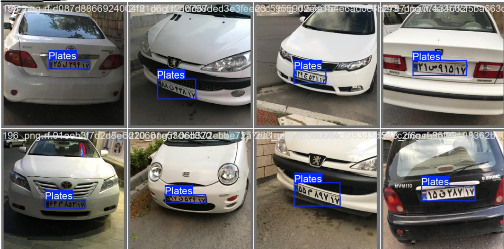

# Persian-Plates-Detection
AI-based Persian car plate and digit recognition using YOLO11

<div align="center">
  
  
  
</div>

---

<div align="center">
  
</div>

---

<div dir="rtl">

# 🚗 تشخیص پلاک و نویسه‌های ایرانی با YOLO11

این پروژه یک سیستم هوشمند برای **تشخیص پلاک خودروهای ایرانی** و استخراج نویسه‌های آن (اعداد و حروف) است. با استفاده از معماری پیشرفته **YOLO11**، این مدل قادر است در شرایط نوری مختلف، پلاک را با دقت بسیار بالا شناسایی کند.

## 🚀 ویژگی‌های کلیدی
- ✅ **تشخیص پلاک:** مکان‌یابی دقیق مستطیل پلاک.
- ✅ **بازخوانی نویسه‌ها:** تشخیص تمام اعداد و حروف فارسی.
- ✅ **سرعت بالا:** بهینه‌شده برای اجرا روی GPU.

## 📂 ساختار فایل‌ها
- `best.pt`: فایل نهایی وزن‌های مدل (۵.۳ مگابایت).
- `result.png`: تصویر نمونه از خروجی تشخیص پلاک.
- `README.md`: توضیحات و راهنمای پروژه.

---

## 🛠 نحوه استفاده (Usage)
</div>

```python
from ultralytics import YOLO

# بارگذاری مدل آموزش‌دیده
model = YOLO('best.pt')

# پیش‌بینی روی عکس جدید
results = model.predict(source='your_image.jpg', save=True)
